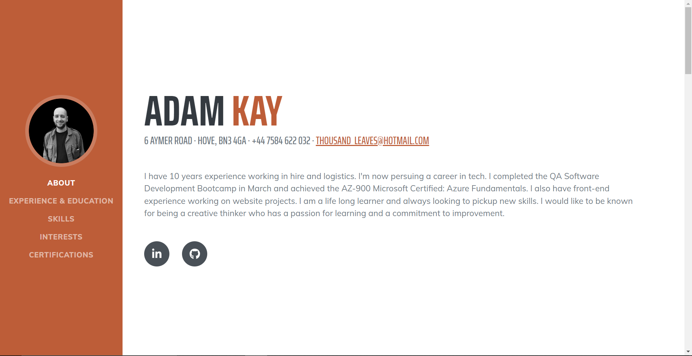
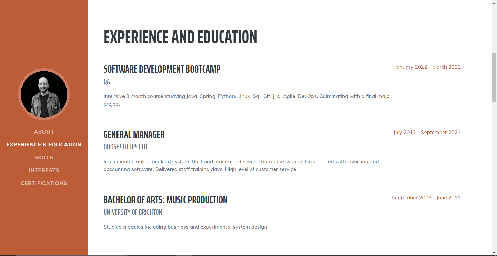
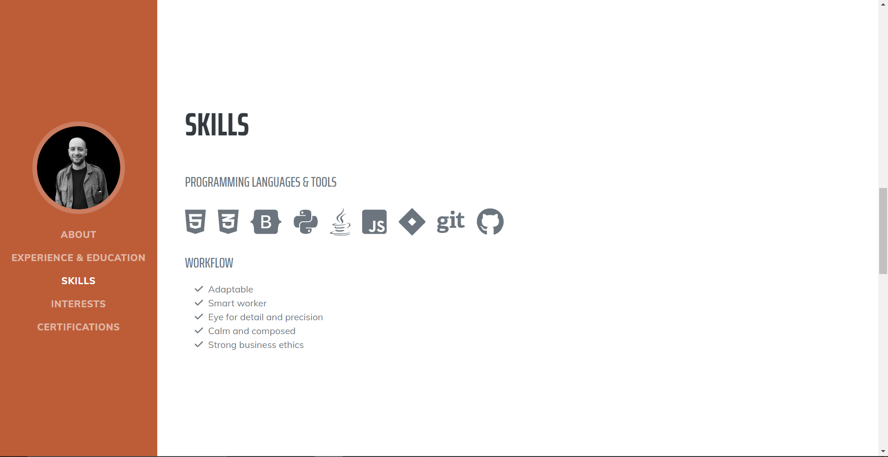

# thousand-leaves.github.io

**What is this project?**

This project is a personal cv / portfolio site to showcase my skills and personality.
I have chosen to host the website for free on GitHub pages

**Why am I doing this?**

It's good to have a personal page that employers can view to get to know more about me.
I also wanted to learn some more about making websites with html, css, bootstrap and javascript as well as test out hosting a site for free on GitHub

**How did I expect the project to go? / What went well? / What didn't go as planned?**

I expected the project to be fairly straight forward as I have made a few basic websites before. Everything has been going fine so far but it's still a very basic site so I anticipate having more learning to do as I improve on this project

**Possible improvements for future revisions of the project?**

The next step is to improve the color pallette to something more professional looking.
I would like to add my own favicon.
I would like to add a portfolio section which lists projects that I have completed.
In the future I probably will want to develop this into a more modern looking site as it looks pretty basic at the moment

**Screenshots**

